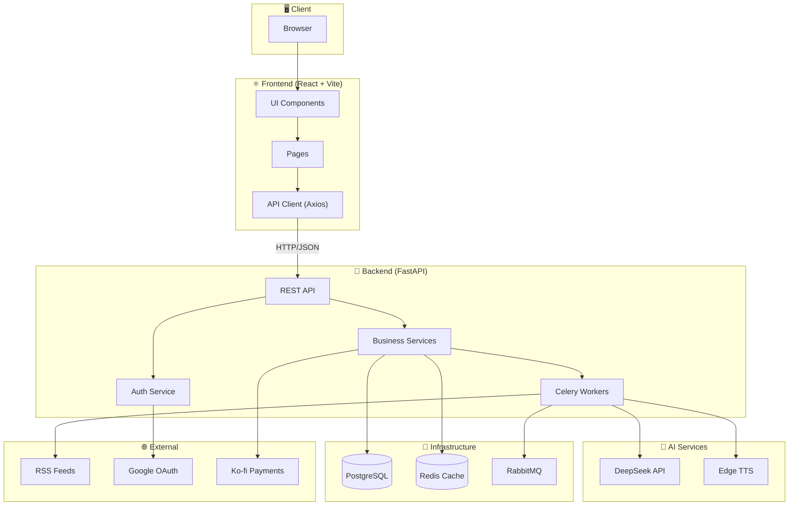

# EchoBrief

  <strong>🎧 Transform news into conversations, one podcast at a time.</strong>

EchoBrief is a full-stack application that revolutionizes news consumption by converting text-based articles into engaging AI-generated podcast audio content. The platform automatically aggregates news from RSS feeds, generates intelligent summaries, creates podcast scripts, and produces high-quality audio using advanced Text-to-Speech technology.

## ✨ Features

### For Users
- 🎙️ **AI-Powered Podcasts** - Generate personalized news podcasts from your favorite topics
- 📰 **News Aggregation** - Access articles from multiple curated news sources
- 🔍 **Smart Search** - Search across articles, topics, and sources
- 👤 **Personalization** - Customize topics, avatar, and preferences
- 📱 **Responsive Design** - Beautiful experience on desktop and mobile

### For Admins
- 👥 **User Management** - View and manage user accounts
- 📊 **Content Control** - CRUD operations for sources and topics
- ⚙️ **System Operations** - Trigger news aggregation and maintenance tasks

## 🏗️ Architecture

## 🛠️ Tech Stack

| Layer | Technologies |
|-------|-------------|
| **Frontend** | React 18, TypeScript, Vite, Tailwind CSS, shadcn/ui |
| **Backend** | FastAPI, Python 3.13, SQLModel, Celery |
| **Database** | PostgreSQL 15, Redis 7+ |
| **Message Queue** | RabbitMQ 3.13+ |
| **AI/ML** | DeepSeek (summarization), Edge TTS (audio) |
| **Auth** | JWT tokens, Google OAuth 2.0 |
| **Payments** | Ko-fi integration |

## 📖 Documentation

| Component | Link |
|-----------|------|
| Backend API | [echobrief-backend/README.md](echobrief-backend/README.md) |
| Frontend | [echobrief-frontend/README.md](echobrief-frontend/README.md) |
| API Swagger | http://localhost:8000/docs |

## 💳 Subscription Plans

| Feature | Free | Paid ($5/month) |
|---------|------|-----------------|
| Podcasts per day | 1 | Unlimited |
| Topics per podcast | 3 | Unlimited |
| Audio quality | Standard | Premium |
| Support | Community | Priority |

---

  Made with passion by the EchoBrief Dev: Naufal Hadi Darmawan 

